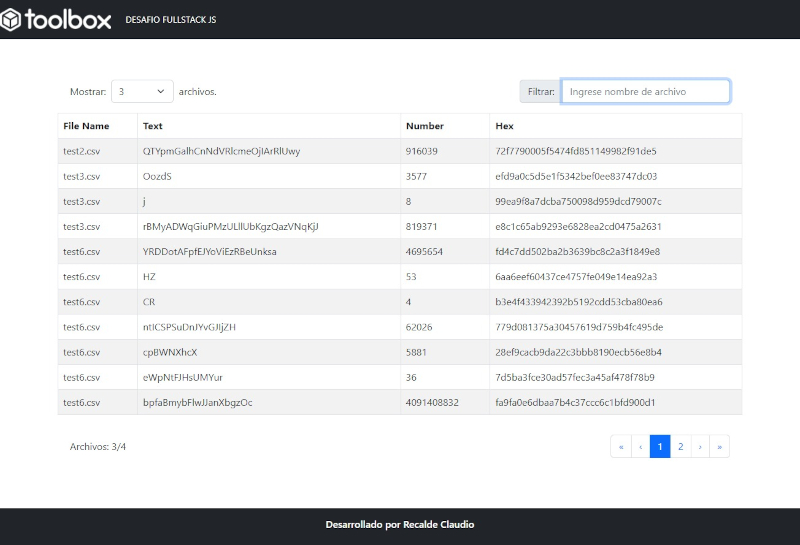

# TOOLBOX - Challenge Developer FullStack JS 

# _FRONTEND - REACT_

### **_DIRECTORIOS_**
- **assets**        //Carpeta de imagenes y estilos globales 
- **components**    // Carpeta de Componentes - Patron diseño atomico 
- **config**    // Carpeta configuracion conexion y rutas
- **conext**    // Carpeta Manejo de datos globales
- **controller**    // Peticiones  API

[Desarrollado por Recalde Claudio](https://cr.net.ar)

